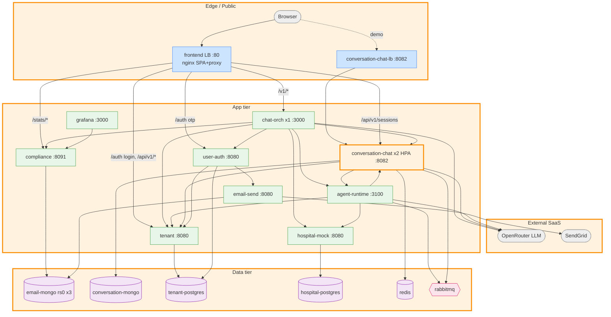
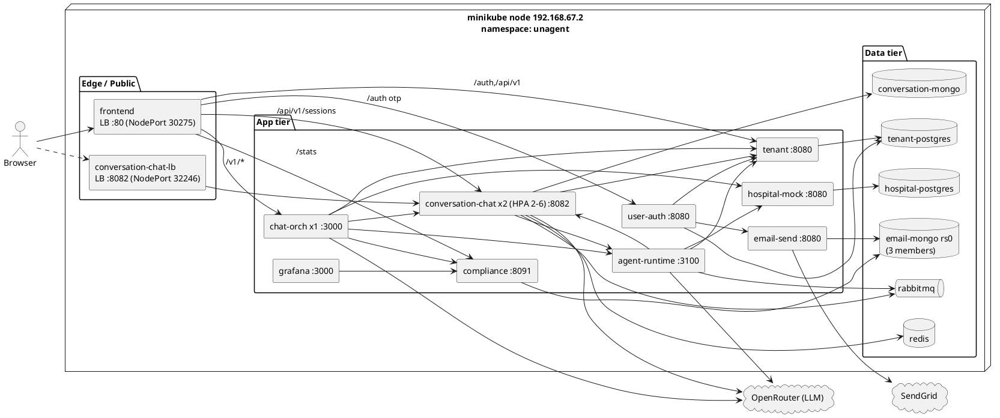

# dev-runner — Kubernetes (minikube) Architecture Reference

> **Purpose:** single source of truth to draw the deployment / component-and-connector
> diagram of the dev-runner platform running on Kubernetes. Everything below was
> captured from the **live `unagent` namespace** on minikube, cross-checked against
> the manifests in `k8s/`. Values (ports, ClusterIPs, NodePorts) are real.
>
> Not tracked in git — this is a working/diagram-source doc.

---

## 0. How to read this

- **Nodes** = Kubernetes workloads (Deployment / StatefulSet / Job) and their `Service`.
- **Edges** = network calls; each edge has **protocol + port + purpose** (see §6, the
  connection graph — that is the heart of the diagram).
- **Zones** (§9) group nodes for layout: Edge / Public, App tier, Data tier, External SaaS.
- Two ready-to-render diagrams are in §11 (Mermaid) and §12 (PlantUML).

Cluster facts:

| Item | Value |
|---|---|
| Cluster | minikube (docker driver), 1 node |
| Node IP | `192.168.67.2` |
| Namespace | `unagent` (all workloads) |
| Packaging | kustomize (`k8s/kustomization.yaml`), images `unagent/<svc>:local`, `imagePullPolicy: Never` |
| DNS | CoreDNS, `<svc>.unagent.svc.cluster.local` |
| Pod CIDR | `10.244.0.0/16` · Service CIDR | `10.96.0.0/12` |

---

## 1. The four architecture patterns (annotate these on the diagram)

| # | Pattern | Realized by | Visual cue |
|---|---------|-------------|-----------|
| **1** | **Replication** | `email-mongo` = 3-member MongoDB **replica set `rs0`** (1 PRIMARY + 2 SECONDARY) behind a **headless Service**; `email-mongo-rs-init` Job bootstraps it. Consumers: **Compliance** + **email-send**. | 3 stacked DB cylinders linked by replication arrows; ring/label "rs0" |
| **2** | **Service discovery** | Every workload has a `Service`; callers use **DNS names = compose names** via CoreDNS. | Label every edge with the DNS name it dials |
| **3** | **Cluster + replication** | `conversation-chat` Deployment is **HPA-managed** (`min 2 / max 6`, CPU 70%), currently **2 replicas**; stateless (Redis/Mongo externalized). | Multiple identical boxes + an HPA badge |
| **4** | **Load balancer** | `Service type: LoadBalancer` for **`conversation-chat-lb`** (the cluster's LB) and **`frontend`** (public entry). | LB icon in front of the replica set / SPA |

`chat-orch` is intentionally **single-replica** (in-memory `SessionStore` + per-process SSE) — mark it `replicas: 1`, not part of the cluster pattern.

---

## 2. Workload inventory (nodes)

### Application tier (Deployments)

| Workload | Replicas | Image | Container port | Language/role | Key outbound deps | Health probe |
|---|---|---|---|---|---|---|
| **frontend** | 1 | `unagent/frontend:local` (nginx) | 80 | SPA + single-origin reverse proxy (public entry) | chat-orch, tenant, user-auth, conversation-chat, compliance | `GET /` :80 |
| **chat-orch** | **1** | `unagent/chat-orch:local` | 3000 | Rust/Axum front-door orchestrator, LLM turn loop, SSE, Telegram | conversation-chat, tenant, compliance, hospital-mock, agent-runtime, user-auth, **OpenRouter** | `GET /health` :3000 |
| **conversation-chat** | **2 (HPA 2–6)** | `unagent/conversation-chat:local` | 8082 | Go sessions/history + LLM (circuit breaker) | redis, conversation-mongo, rabbitmq, agent-runtime, tenant, **OpenRouter** | `GET /api/v1/health` :8082 |
| **agent-runtime** | 1 | `unagent/agent-runtime:local` | 3100 | TS/Express ACR+tenant stubs + session proxy | conversation-chat, hospital-mock, tenant, rabbitmq, **OpenRouter** | `GET /health` :3100 |
| **tenant** | 1 | `unagent/tenant:local` | 8080 | Go auth + tenant admin (JWT issuer) | tenant-postgres | `GET /api/v1/health` :8080 |
| **user-auth** | 1 | `unagent/user-auth:local` | 8080 | Go OTP auth | tenant-postgres (`user_auth` db), email-send, tenant | `GET /health` :8080 |
| **hospital-mock** | 1 | `unagent/hospital-mock:local` | 8080 | Python/Flask scheduling mock | hospital-postgres | `GET /health` :8080 |
| **compliance** | 1 | `unagent/compliance:local` | 8091 | Python/FastAPI KPIs + audit writer | **email-mongo (rs0)** | `GET /health` :8091 |
| **email-send** | 1 | `unagent/email-send:local` | 8080 | Java/Spring outbound email + audit | **email-mongo (rs0)**, **SendGrid** | `GET /health` :8080 (startupProbe) |
| **grafana** | 1 | `grafana/grafana-oss:11.6.0` | 3000 | Observability dashboards | compliance (`/stats`) | `GET /api/health` :3000 |

### Data tier (StatefulSets)

| Workload | Replicas | Image | Port | PVC | Holds |
|---|---|---|---|---|---|
| **email-mongo** | **3** | `mongo:7` (`--replSet rs0`) | 27017 | 1Gi ×3 | `UN_compliance_db.audit_logs` (compliance) + `email_audit.email_events` (email-send) — **replica set rs0** |
| **conversation-mongo** | 1 | `mongo:7` | 27017 | 1Gi | `conversatory` sessions/history |
| **tenant-postgres** | 1 | `postgres:16-alpine` | 5432 | 1Gi | `tenants/users/user_tenants` + `user_auth` db |
| **hospital-postgres** | 1 | `postgres:16-alpine` | 5432 | 1Gi | doctors + appointments |
| **rabbitmq** | 1 | `unagent/rabbitmq:local` | 5672 / 15672 | 1Gi | `chat_requests` / `chat_results` queues |
| **redis** | 1 *(Deployment)* | `redis:7-alpine` | 6379 | — | conversation-chat session cache (logical db `1`) |

### One-shot Jobs (bootstrap; not long-running on the diagram, show as init steps)

| Job | Image | Does | Gated on |
|---|---|---|---|
| **email-mongo-rs-init** | `mongo:7` | `rs.initiate()` → elects PRIMARY of `rs0` | all 3 mongo members reachable |
| **tenant-migrate** | `migrate/migrate:v4.18.1` | golang-migrate `up` (schema) | tenant-postgres ready |
| **tenant-seed** | `unagent/tenant:local` | seeds `admin@demo.com` | migrations `version ≥ 4` |

---

## 3. Service inventory (live values)

| Service | Type | ClusterIP | Port → target | NodePort | Selects | Role |
|---|---|---|---|---|---|---|
| **frontend** | **LoadBalancer** | 10.108.50.133 | 80 → 80 | **30275** | frontend | **Public entry** (pattern #4) |
| **conversation-chat-lb** | **LoadBalancer** | 10.100.140.117 | 8082 → 8082 | **32246** | conversation-chat | **Cluster LB** (pattern #4) |
| conversation-chat | ClusterIP | 10.102.141.211 | 8082 → 8082 | — | conversation-chat | internal (pattern #2/#3) |
| **email-mongo** | **Headless** (`None`) | None | 27017 | — | email-mongo | stable per-pod DNS for `rs0` (pattern #1) |
| conversation-mongo | ClusterIP | 10.99.79.171 | 27017 | — | conversation-mongo | |
| tenant-postgres | ClusterIP | 10.108.21.72 | 5432 | — | tenant-postgres | |
| hospital-postgres | ClusterIP | 10.97.90.1 | 5432 | — | hospital-postgres | |
| redis | ClusterIP | 10.107.114.33 | 6379 | — | redis | |
| rabbitmq | ClusterIP | 10.107.56.246 | 5672, 15672 | — | rabbitmq | AMQP + mgmt UI |
| chat-orch | ClusterIP | 10.104.30.136 | 3000 | — | chat-orch | |
| agent-runtime | ClusterIP | 10.105.181.22 | 3100 | — | agent-runtime | |
| tenant | ClusterIP | 10.98.214.1 | 8080 | — | tenant | |
| user-auth | ClusterIP | 10.109.93.32 | 8080 | — | user-auth | |
| hospital-mock | ClusterIP | 10.100.228.230 | 8080 | — | hospital-mock | |
| compliance | ClusterIP | 10.96.199.33 | 8091 | — | compliance | |
| email-send | ClusterIP | 10.99.188.28 | 8080 | — | email-send | |
| grafana | ClusterIP | 10.98.206.52 | 3000 | — | grafana | |

---

## 4. Pattern #1 detail — `email-mongo` replica set `rs0`

```
                 headless Service "email-mongo" (clusterIP: None, publishNotReadyAddresses)
                 ┌───────────────┬───────────────┬───────────────┐
                 ▼               ▼               ▼
        email-mongo-0     email-mongo-1     email-mongo-2     (StatefulSet, podManagementPolicy: Parallel)
        :27017            :27017            :27017
        PRIMARY  ◀──repl──▶  SECONDARY  ◀──repl──▶  SECONDARY     (rs0; auto re-election on PRIMARY loss)
        PVC 1Gi           PVC 1Gi           PVC 1Gi

  member DNS (namespace-relative, used in rs.initiate AND consumer URI):
    email-mongo-0.email-mongo:27017, email-mongo-1.email-mongo:27017, email-mongo-2.email-mongo:27017

  consumer connection string (ConfigMap platform-config / EMAIL_MONGO_RS_URI):
    mongodb://email-mongo-0.email-mongo:27017,email-mongo-1.email-mongo:27017,email-mongo-2.email-mongo:27017/?replicaSet=rs0

  consumers:  compliance  (DB UN_compliance_db, coll audit_logs)
              email-send  (DB email_audit,      coll email_events)  ← initContainer waits for isWritablePrimary
  bootstrap:  Job email-mongo-rs-init → rs.initiate(3 members) → waits for PRIMARY
```

---

## 5. Service discovery (pattern #2) — DNS table

All in-cluster calls use the short Service name (resolves to `<svc>.unagent.svc.cluster.local`):

| DNS name | → ClusterIP:port | Backed by |
|---|---|---|
| `chat-orch:3000` | 10.104.30.136:3000 | chat-orch |
| `conversation-chat:8082` | 10.102.141.211:8082 | conversation-chat (2 pods) |
| `agent-runtime:3100` | 10.105.181.22:3100 | agent-runtime |
| `tenant:8080` | 10.98.214.1:8080 | tenant |
| `user-auth:8080` | 10.109.93.32:8080 | user-auth |
| `hospital-mock:8080` | 10.100.228.230:8080 | hospital-mock |
| `compliance:8091` | 10.96.199.33:8091 | compliance |
| `email-send:8080` | 10.99.188.28:8080 | email-send |
| `redis:6379` | 10.107.114.33:6379 | redis |
| `rabbitmq:5672` | 10.107.56.246:5672 | rabbitmq |
| `conversation-mongo:27017` | 10.99.79.171:27017 | conversation-mongo |
| `tenant-postgres:5432` | 10.108.21.72:5432 | tenant-postgres |
| `hospital-postgres:5432` | 10.97.90.1:5432 | hospital-postgres |
| `email-mongo-{0,1,2}.email-mongo:27017` | per-pod (headless) | email-mongo rs0 |

---

## 6. Connection graph (the diagram edges)

Format: **source → target `:port` (protocol) — purpose**

### Browser / public

- Browser → **frontend** `:80` (HTTP, NodePort 30275 / LB) — SPA + single-origin API
- (demo) Client → **conversation-chat-lb** `:8082` (HTTP, NodePort 32246 / LB) — direct cluster access

### frontend nginx reverse-proxy (single origin → backends)

- frontend → **chat-orch** `:3000` — `/v1/*`, `/v1/chat/stream` (SSE)
- frontend → **tenant** `:8080` — `/auth/*`, `/api/admin/*`, `/api/v1/tenants/*`, `/api/v1/users*`, `/api/v1/auth/*`, `/api/v1/tool-registry*`
- frontend → **user-auth** `:8080` — `/auth/request-code`, `/auth/verify-code`, `/auth/resend-code`, `/auth/users*`
- frontend → **conversation-chat** `:8082` — `/api/v1/sessions*`, `/api/v1/escalations*`
- frontend → **compliance** `:8091` — `/stats/*`

### Backend → backend (HTTP unless noted)

- chat-orch → **conversation-chat** `:8082` — session/turn proxy (via agent-runtime shape)
- chat-orch → **agent-runtime** `:3100` — ACR/session bridge
- chat-orch → **tenant** `:8080` — tenant lookups
- chat-orch → **compliance** `:8091` — `record_turn` / `record_feedback` (metricas)
- chat-orch → **hospital-mock** `:8080` — hospital tool calls
- chat-orch → **user-auth** `:8080` — auth flows
- agent-runtime → **conversation-chat** `:8082` — proxy to sessions
- agent-runtime → **hospital-mock** `:8080` — tool execution
- agent-runtime → **tenant** `:8080` — per-tenant ACR config (`TENANT_INTERNAL_URL`)
- conversation-chat → **agent-runtime** `:3100` — `ACR_SERVICE_URL` + `TENANT_SERVICE_URL`
- conversation-chat → **tenant** `:8080` — `AUTH_SERVICE_URL`
- user-auth → **email-send** `:8080` — send OTP email (`/api/v1/emails`)
- user-auth → **tenant** `:8080` — tenant exchange (`TENANT_INTERNAL_URL`)
- grafana → **compliance** `:8091` — dashboards datasource (`/stats`)

### Backend → data stores

- conversation-chat → **redis** `:6379` (RESP, db 1) — session cache
- conversation-chat → **conversation-mongo** `:27017` (Mongo) — sessions/history
- conversation-chat → **rabbitmq** `:5672` (AMQP) — consume `chat_requests`, publish `chat_results`
- agent-runtime → **rabbitmq** `:5672` (AMQP) — broker
- compliance → **email-mongo rs0** `:27017` (Mongo, `?replicaSet=rs0`) — audit_logs
- email-send → **email-mongo rs0** `:27017` (Mongo, `?replicaSet=rs0`) — email_events
- tenant → **tenant-postgres** `:5432` (Postgres) — auth/tenant tables
- user-auth → **tenant-postgres** `:5432` (Postgres, `user_auth` db)
- hospital-mock → **hospital-postgres** `:5432` (Postgres)

### Bootstrap Jobs (init-time edges)

- email-mongo-rs-init → email-mongo-{0,1,2} `:27017` — `rs.initiate`
- tenant-migrate → tenant-postgres `:5432` — schema migrations
- tenant-seed → tenant-postgres `:5432` — seed admin

### External SaaS (egress, internet)

- chat-orch, conversation-chat, agent-runtime → **OpenRouter** `https://openrouter.ai/api/v1` (HTTPS) — LLM completions
- email-send → **SendGrid** (HTTPS, sandbox mode) — email delivery
- chat-orch → **Telegram** Bot API (optional; not configured in this deploy)

---

## 7. Public ingress / frontend route table (single origin)

Browser hits **one origin** (`frontend` LB :80). nginx (`FrontEnd/nginx.conf`) fans out by path
to backend Services by DNS (static upstreams, no Docker resolver). Longest/exact prefix wins:

| Path | → Service |
|---|---|
| `/v1/chat/stream` (SSE), `/v1/*` | chat-orch:3000 |
| `/auth/request-code`, `/auth/verify-code`, `/auth/resend-code`, `/auth/users*` | user-auth:8080 |
| `/auth/*` (login etc.), `/api/admin/*`, `/api/v1/tenants/*`, `/api/v1/users*`, `/api/v1/auth/*`, `/api/v1/tool-registry*` | tenant:8080 |
| `/api/v1/sessions*`, `/api/v1/escalations*` | conversation-chat:8082 |
| `/stats/*` | compliance:8091 |
| everything else | static SPA (`index.html`) |

---

## 8. Config & secrets

- **ConfigMap `platform-config`** — `OPENAI_BASE_URL`, `OPENAI_DEFAULT_MODEL`, `BACKEND_CHANNEL_ENABLED=false`, `LOG_FORMAT`, `GIN_MODE`, **`EMAIL_MONGO_RS_URI`**.
- **ConfigMaps (generated)** — `tenant-postgres-init`, `hospital-postgres-init`, `tenant-migrate-migrations` (init SQL / migrations mounted into the DBs/Jobs).
- **Secret `platform-secrets`** — `OPENROUTER_API_KEY` (→ injected as `OPENAI_API_KEY` to chat-orch & conversation-chat), `JWT_SECRET`, `INTERNAL_API_KEY`, `SENDGRID_API_KEY`, `BACKEND_CHANNEL_KEY`, DB passwords, full DB URLs, `GRAFANA_ADMIN_PASSWORD`, `SEED_PASSWORD`.

---

## 9. Zones / grouping (for diagram layout)

```
[ EXTERNAL SaaS ]   OpenRouter (LLM)        SendGrid (email)        (Telegram - optional)
        ▲                  ▲                      ▲
[ EDGE / PUBLIC ]   Browser ─▶ frontend (LB :80) ───────────────────────┐
                                                  conversation-chat-lb (LB :8082, demo)
        │
[ APP TIER ]   chat-orch(1) · conversation-chat(2,HPA) · agent-runtime(1) ·
               tenant(1) · user-auth(1) · hospital-mock(1) · compliance(1) ·
               email-send(1) · grafana(1)
        │
[ DATA TIER ]  email-mongo(rs0 ×3) · conversation-mongo · tenant-postgres ·
               hospital-postgres · redis · rabbitmq
        │
[ INIT JOBS ]  email-mongo-rs-init · tenant-migrate · tenant-seed
```

Suggested layout: External SaaS top, Edge/Public next, App tier middle (put
`conversation-chat` as a stack of 2 with an HPA badge and the LB in front), Data tier
bottom (draw `email-mongo` as 3 cylinders with replication arrows + "rs0").

---

## 10. Key request flows (sequence cues)

**A. Web chat**
Browser → frontend `/v1/chat` → chat-orch → (agent-runtime →) conversation-chat → OpenRouter;
hospital tool calls → hospital-mock; metrics → compliance; reply streamed back via
chat-orch SSE `/v1/chat/stream`.

**B. Auth — password login**
Browser → frontend `/auth/login` → tenant → tenant-postgres → JWT back. *(verified live)*

**C. Auth — OTP**
Browser → frontend `/auth/request-code` → user-auth → email-send → SendGrid (+ audit to email-mongo rs0);
`/auth/verify-code` → user-auth → tenant (session exchange).

**D. Analytics**
Browser → frontend `/stats/kpis` & `/stats/timeseries` → compliance (in-memory counters);
grafana also reads compliance `/stats`.

---

## 11. Mermaid (paste into a Mermaid renderer / GitHub)



---

## 12. PlantUML (deployment diagram starter)



---

## 13. Verified-live evidence (for captions)

- Pattern #1: `rs.status()` → `email-mongo-0=SECONDARY, email-mongo-1=PRIMARY, email-mongo-2=SECONDARY`; deleting PRIMARY → re-election in ~3 s; doc written on primary read from secondary.
- Pattern #2: `getent hosts conversation-chat email-mongo redis rabbitmq` resolves all from inside a pod.
- Pattern #3: `hpa conversation-chat` → `cpu: 1%/70%, min 2, max 6, replicas 2`; 2 endpoint IPs.
- Pattern #4: `frontend` LB → HTTP 200 (SPA), `conversation-chat-lb` → HTTP 200, traffic split across both replicas.
- End-to-end: `POST /auth/login` (admin@demo.com) through the frontend LB returned a valid JWT.
