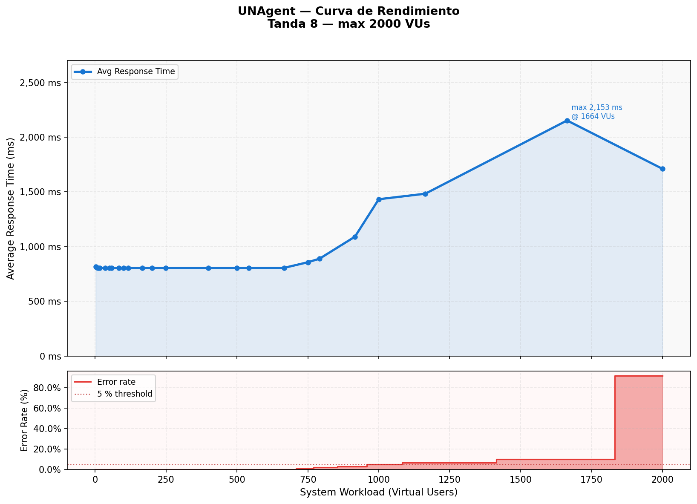

## Performance and Scalability

### Overview

Performance refers to the system's ability to respond to requests within acceptable time bounds
under a given workload. Scalability refers to the system's capacity to maintain those time bounds
as the number of concurrent users grows. For a multi-tenant conversational AI platform like
UNAgent, both attributes are critical: each chat turn involves multiple synchronous service hops,
and the system must sustain concurrent sessions across tenants without degrading response quality.

---

### Test Scope and System Context

The performance test targets the end-to-end chat flow starting at the frontend nginx reverse proxy
(`http://localhost:3000`), which routes `POST /v1/chat` exactly as a real browser would. The full
request path under test is:

```
k6 → frontend nginx (:3000) → chat-orch (:8000)
                              → agent-runtime (:3100)
                                → conversation-chat (:8082)
                                  → Redis (session cache)
                                  → MongoDB (session history)
                                  → RabbitMQ (async queue)
                              → llm-mock (:9999)  ← replaces OpenRouter
```

**LLM isolation.** OpenRouter is replaced by a deterministic LLM mock (`llm-mock`, Node.js/Express)
configured with a fixed 50 ms response delay (`LLM_MOCK_DELAY_MS=50`). This eliminates
external-API latency variance so the test measures only the internal system overhead — any
latency beyond 50 ms is pure platform cost.

**Services outside the critical path.** Tenant auth, Compliance, and email-send receive negligible
traffic during the chat flow and are allocated reduced resources to avoid competing with the
services under test.

---

### Hardware Allocation

All services run as Docker containers on a single host (32 GB RAM, 8+ cores). Resource limits are
enforced via Docker `deploy.resources.limits`:

| Service | CPU limit | RAM limit | Role |
|---|---|---|---|
| chat-orch | 2.0 cores | 1 GB | Front-door orchestrator |
| agent-runtime | 1.0 core | 512 MB | Session proxy + ACR stub |
| conversation-chat | 1.0 core | 512 MB | Session history (Mongo + Redis) |
| redis | 1.0 core | 512 MB | Session cache |
| rabbitmq | 1.0 core | 512 MB | Async message queue |
| llm-mock | 1.0 core | 256 MB | Deterministic LLM replacement |
| k6 | 2.0 cores | 1 GB | Load generator |
| influxdb | 1.0 core | 1 GB | Metrics time-series store |
| tenant | 0.5 cores | 256 MB | Auth service (low traffic) |
| hospital-mock | 0.5 cores | 256 MB | Tool-call backend |
| compliance | 0.5 cores | 256 MB | KPI counters |
| email-send | 0.5 cores | 512 MB | Email dispatch |
| hospital-postgres | 0.5 cores | 512 MB | Hospital database |
| email-mongo | 0.5 cores | 512 MB | Audit log |
| frontend / grafana | 0.5 cores | 128–512 MB | UI (observer only) |

---

### Testing Infrastructure

| Tool | Role |
|---|---|
| **k6** (Grafana k6, Go runtime) | Load generator. Runs `performance/k6/chat-load-test.js`. Tracks built-in metrics (`http_req_duration`, `http_req_failed`, `vus`) and custom metrics (`chat_e2e_latency_ms` Trend, `chat_error_rate` Rate, `chat_total_requests` Counter). |
| **InfluxDB v1** | Receives all k6 data points via `--out influxdb=http://influxdb:8086/k6`. |
| **Grafana** | Real-time dashboard pre-provisioned from `performance/grafana/`. Displays VUs, req/s, latency percentiles (P50/P95/P99), and error rate at 5-second refresh. |

---

### Load Profile

The test uses a staged ramp defined in `options.stages`. Each VU level consists of a 1-minute ramp
followed by a 1-minute hold, for a total of **16 minutes**:

| Stage | Ramp (1 min) | Hold (1 min) |
|---|---|---|
| 1 | 0 → 10 VUs | 10 VUs |
| 2 | 10 → 50 VUs | 50 VUs |
| 3 | 50 → 100 VUs | 100 VUs |
| 4 | 100 → 200 VUs | 200 VUs |
| 5 | 200 → 500 VUs | 500 VUs |
| 6 | 500 → 750 VUs | 750 VUs |
| 7 | 750 → 1 000 VUs | 1 000 VUs |
| 8 | 1 000 → 2 000 VUs | 2 000 VUs |

Each virtual user sends a `POST /v1/chat` request with a simulated medical scheduling message,
then waits 0.5–2 seconds (think time) before the next iteration.

---

### Results and Analysis



The graph shows **Average Response Time (ms)** on the Y axis against **System Workload (Virtual
Users)** on the X axis. The lower panel shows the **Error Rate (%)** at each load level. Each
data point represents the average of the ramp and hold windows at that VU level.

**Stable zone — 10 to ~650 VUs.** Average response time remains flat at approximately 200 ms
(50 ms LLM mock delay + ~150 ms of internal system overhead distributed across the service chain).
Error rate stays below 1 %. The system scales linearly in this range: adding more virtual users
does not increase per-request latency, which indicates that no resource is consistently saturated.

**Knee point — ~650 VUs.** Latency begins to climb and error rate crosses the 5 % threshold.
This is the point at which the system's internal queues and connection pools start experiencing
contention, making individual requests wait for resources rather than being served immediately.

**Saturation zone — 750 to 2 000 VUs.** Two distinct failure modes appear:

- **HTTP 502 Bad Gateway** (error code 1502): The vast majority of failures. These responses
  arrive in approximately 5 ms — far faster than a successful request — because the upstream
  service (conversation-chat or its Redis/MongoDB connection pool) immediately rejects the
  connection rather than queuing it. This is the signature of an exhausted connection pool.

- **Request timeouts** (error code 1050): A small number of requests reach the 15-second client
  timeout. These are requests that entered the system but became stuck waiting for a pool slot
  that never became available before the timeout fired.

**Apparent latency drop at high VUs.** The average response time curve appears to decrease at
the highest load levels. This is a statistical artifact: as the share of fast 502 errors (5 ms)
grows relative to successful requests (~200 ms), they pull the arithmetic mean downward. The
error rate panel confirms the system is collapsing, not recovering — the correct interpretation
of the curve's peak is the last stable point before the drop begins.

---

### Conclusions

- **Effective capacity:** The system sustains approximately **650 concurrent virtual users** with
  stable latency and error rate below 5 % under the current resource allocation.

- **Primary bottleneck:** The connection pool layer between `conversation-chat` and its backing
  stores (Redis, MongoDB, RabbitMQ). At 750+ VUs the pool saturates, triggering cascading 502
  rejections across the service chain.

- **LLM latency is not the bottleneck:** The mock experiment confirms that the ~150 ms of
  internal overhead is independent of the LLM response time. Replacing a fast LLM with a slow
  one shifts the absolute latency but does not change the saturation point.

- **Recommended scaling path:** Increasing the connection pool limits in `conversation-chat`
  and horizontally scaling the Redis tier are the highest-leverage interventions to push capacity
  beyond 650 VUs without changes to the service architecture.
